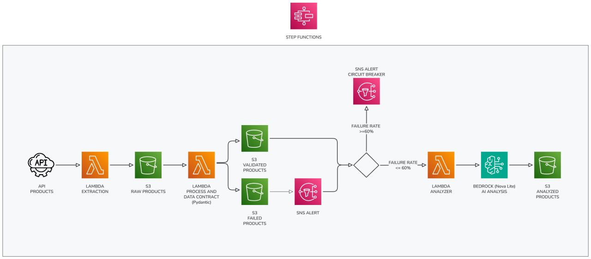

# Good Products Deal

> **Serverless ETL pipeline** demonstrating AWS best practices: Step Functions orchestration, circuit breaker pattern, AI-powered analysis with Bedrock, and infrastructure as code with SAM.
> 
> Built to showcase production-ready serverless architecture and AWS services integration.

[](https://www.python.org/)
[](https://aws.amazon.com/serverless/sam/)
[](LICENSE)

Serverless pipeline for product extraction, validation, and analysis using AWS Step Functions, Lambda, and Amazon Bedrock.

## Architecture

──────────────────────────────────────────────────────────────────┘
```

## Components

### 1. Extractor Lambda

Extracts product data from an external API.

- **Source**: [DummyJSON Products API](https://dummyjson.com/products)
- **Output**: S3 bucket (`raw/` prefix)
- **Timeout**: 30 seconds

### 2. Processor Lambda

Validates extracted data using Data Contracts with Pydantic.

**Validation Rules:**

| Field | Type | Validation |
|-------|------|------------|
| `id` | int | Required |
| `title` | str | Required |
| `description` | str | Required |
| `price` | float | Must be > 0 |
| `discountPercentage` | float | Between 0 and 100 |
| `rating` | float | Between 0 and 5 |
| `stock` | int | Must be >= 0 |
| `brand` | str | Required |
| `category` | str | Required |
| `thumbnail` | str | Required |

**Outputs:**
- Valid products → `structured/processed/`
- Invalid products → `structured/failed/`

### 3. Analyzer Lambda

Uses Amazon Bedrock (Nova Lite) for AI-powered product analysis.

**Response Format:**

```json
{
  "is_good_deal": true,
  "price_category": "budget | mid-range | premium",
  "confidence": 0.85
}
```

### 4. Step Functions (Orchestration)

Implements a **Circuit Breaker Pattern** for resilience:

| Condition | Action |
|-----------|--------|
| `failure_rate >= 60%` | Stops execution + sends critical alert |
| `failed_count > 0` | Sends alert + continues to analysis |
| No failures | Proceeds to analysis |

## Project Structure

```
good-products-deal/
├── lambdas/
│   ├── 1.extractor/
│   │   ├── handler.py
│   │   └── requirements.txt
│   ├── 2.processor/
│   │   ├── handler.py
│   │   └── requirements.txt
│   └── 3.analyzer/
│       ├── handler.py
│       └── requirements.txt
├── statemachine/
│   └── definition.json
├── .env.example
├── pyproject.toml
├── samconfig.toml
├── template.yaml
└── README.md
```

## Prerequisites

- Python 3.12+
- AWS CLI configured
- AWS SAM CLI
- AWS account with Amazon Bedrock access (Nova Lite model enabled)

## Deployment

### 1. Build

```bash
sam build
```

### 2. Deploy

```bash
sam deploy --guided
```

Follow the prompts:

```
Stack Name: good-products-deal
AWS Region: us-east-1
Parameter RawPrefix [raw]: (press Enter)
Parameter StructuredPrefix [structured]: (press Enter)
Parameter AnalyzedPrefix [analyzed]: (press Enter)
Parameter AwsRegionName [us-east-1]: (press Enter)
Parameter AlertEmail: your-email@example.com
Confirm changes before deploy [y/N]: y
Allow SAM CLI IAM role creation [Y/n]: y
Disable rollback [y/N]: n
Save arguments to configuration file [Y/n]: y
```

After the first deployment, you can simply run:

```bash
sam deploy
```

### 3. Outputs

After deployment, SAM will display:

- `ProductsBucketName`: S3 bucket for products data
- `StateMachineArn`: ARN of the Step Functions state machine
- `FailuresTopicArn`: ARN of the SNS topic for alerts

## Execution

### Via AWS Console

1. Go to AWS Step Functions
2. Find `products-analyzer` state machine
3. Click "Start execution"
4. Input: `{}`

### Via AWS CLI

```bash
aws stepfunctions start-execution \
  --state-machine-arn <StateMachineArn from outputs> \
  --input '{}'
```

## S3 Data Flow

```
<bucket-name>/
├── raw/
│   └── products-2026-01-25T120000.json      # Raw API data
├── structured/
│   ├── processed/
│   │   └── products-2026-01-25T120000.json  # Validated products
│   └── failed/
│       └── products-2026-01-25T120000.json  # Products with errors
└── analyzed/
    └── analyzed/
        └── product-2026-01-25T120000.json   # AI-analyzed products
```

## Monitoring

### CloudWatch Logs

Each Lambda generates structured JSON logs:

```json
{
  "status": "success",
  "products_count": 30,
  "timestamp": "2026-01-25T120000"
}
```

### Email Alerts

The SNS Topic sends emails when:
- Products fail validation
- Circuit breaker is triggered (>60% failures)

## Cleanup

To delete all resources:

```bash
sam delete
```

## Tech Stack

- **Runtime**: Python 3.12
- **IaC**: AWS SAM
- **Orchestration**: AWS Step Functions
- **Validation**: Pydantic
- **AI**: Amazon Bedrock (Nova Lite)
- **Storage**: Amazon S3
- **Notifications**: Amazon SNS

## License

MIT
